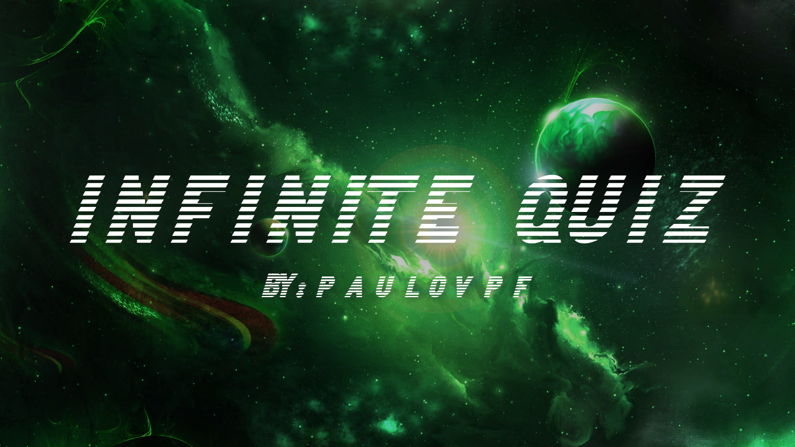

<h1 align="center">Infinite Quiz (NLW Expert)</h1>

Website desenvolvido para criação de diversos tipos de Quizzes. Use-o para jogar com amigos, família e muito mais!

  <a href="#-tecnologias">Tecnologias</a>&nbsp;&nbsp;&nbsp;|&nbsp;&nbsp;&nbsp;
  <a href="#-projeto">Projeto</a>&nbsp;&nbsp;&nbsp;|&nbsp;&nbsp;&nbsp;
  <a href="#memo-licença">Licença</a>

 

  

## :ice_cream: Tecnologias

Esse projeto foi desenvolvido com as seguintes tecnologias:

- JavaScript
- HTML & CSS
- Git

## :doughnut: Projeto

Website com intuito de centralizar todos os seus perfis online em um único website, facilitando para outras pessoas encontrarem e acessarem seus perfis em diferentes plataformas a partir de um único local.

## :memo: Licença

Esse projeto está sob a licença da Rocketseat.

---

Feito com :heartpulse: por Paulo Victor 